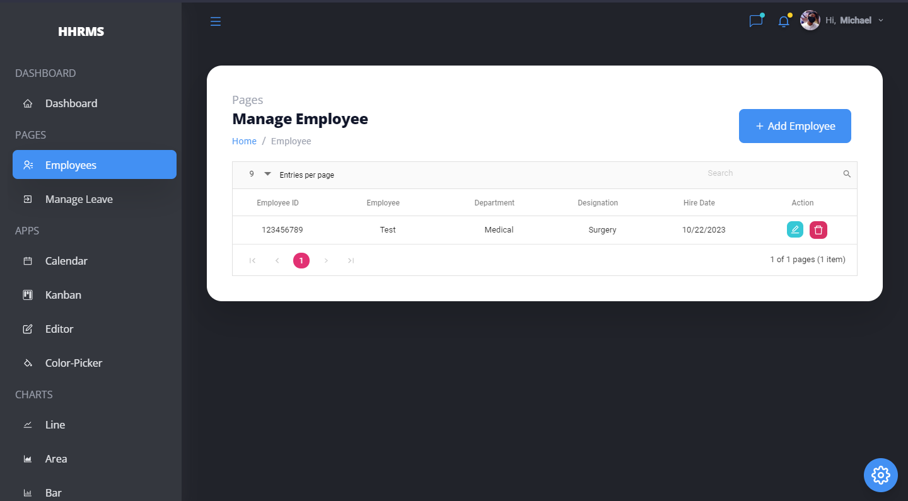

   <h1> Hospital Human Resource Management System </h1>

## NOTE
- This are the initial code for Hospital Human Resource Management System (HHRMS)
- Do not share links

    

# Development

## Application Requirements
- Visual Studio Code - https://code.visualstudio.com
- Git - https://git-scm.com/downloads
- Node.js - https://nodejs.org/en
- MongoDB - https://www.mongodb.com/try/download/community

*use recommended configuration in all application installation process*

## Instruction
Kung gusto niyo ma download buong file sa desktop or laptop at pwede niyo din ma open sa visual studio code at i-run. 
need niyo i clone yung github link sa local computer niyo or laptop. sundan niyo yung steps kung paano.

1. punta ka sa command prompt or git bash propmt
2. type `cd desktop` para sa desktop  siya ma sa-save at mabilis niyo makita yung file.
3. type `git clone https://github.com/edillormark2/HospitalHumanResourceManagementSystem.git`

*then okay na yan na save na yan sa desktop niyo tignan niyo nalang.* 

## Repository Rules
- remote shorthand name: **origin**
- main branch: **master**
- **DO NOT** push directly in **master branch**, always make a branch and then make a pull request/merge request

## development flow 
1. pull latest changes in github repository `git pull origin master`
2. make a branch `git branch <branch name>`
3. switch to newly created branch `git switch <branch name>`
4. make your changes *coding*
5. test changes
6. stage file changes `git add .`
7. commit changes in branch `git commit -m "commit message"`
8. push branch in github repository `git push origin <branch name>`
9. make a pull request
10. wait for approval

## Git Basic Command
- `git init` make a repository
- `git branch` check created branches
- `git branch <branch name>` create branch
- `branch -rm <branch name>` remove branch
- `git switch <branch name>` switch to a diffent branch
- `git status` check file changes
- `git add .` stage all file for commit
- `git commit -m "commit message"` commit changes in branch
- `git pull origin master` fetch latest version of master branch
- `git push origin <branch name>` upload changes in a branch in github repository

# NO DIRECT PUSHING IN MASTER BRANCH